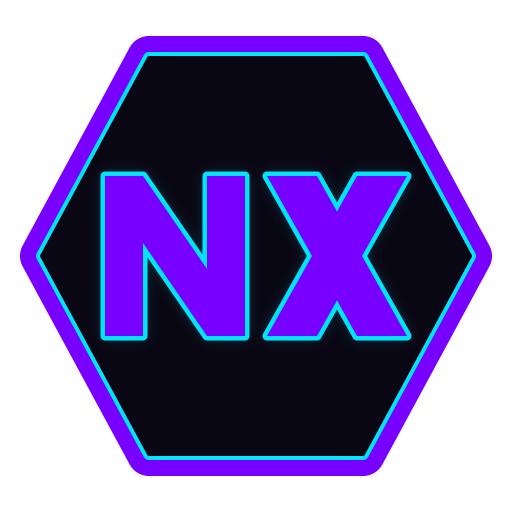
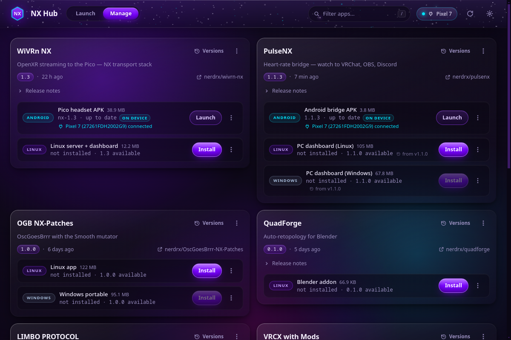
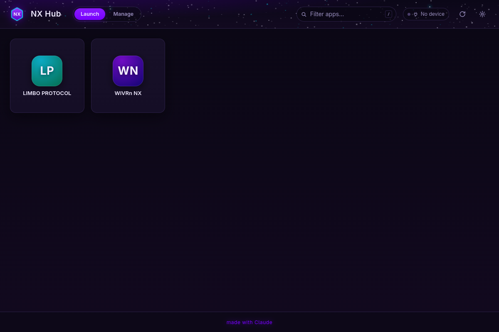

<div align="center">



# NX Hub

### One place for every app you ship.

**Installer · Updater · Launcher — powered directly by your GitHub releases.**

[](https://github.com/nerdrx/nx-hub/releases/latest)
[](LICENSE)


<br>



<br><br>



</div>

<br>

NX Hub turns a GitHub account into a first-class software distribution channel.
It discovers every repository you publish, understands the artifacts inside each
release, and handles the entire lifecycle that follows: installation, updates,
rollbacks, launching, and clean removal — across Linux, Windows, and Android.

There is no store to submit to, no manifest to maintain, and no infrastructure
to run. The moment a release goes live on GitHub, it is live in the hub.

<br>

## Capabilities

### Discovery

The hub scans complete GitHub accounts and any individually pinned
`owner/repo` — public and private alike. New repositories and new releases
appear automatically on the next refresh; nothing is ever registered by hand.
Repositories without installable releases are kept visible in a dedicated
section, each with the reason: not yet released, released without installable
files, or intentionally curated out.

A release that only patches a single platform never degrades the others. Each
artifact is sourced from the newest release that actually ships it, is labelled
with the version it came from, and is compared against that version — so an
Android-only hotfix leaves your desktop builds exactly where they belong.

### Installation

Every artifact type gets a purpose-built engine rather than a generic download:

| Artifact | Strategy |
| --- | --- |
| `.AppImage` | Extracted at install time — runs identically **with or without FUSE**. Application icons and desktop entries are derived from the payload itself. |
| Tarball → prefix | Unpacked into `~/.local` with **every written file recorded**, enabling byte-exact uninstalls even across a shared prefix. |
| `.apk` | Sideloaded to the connected headset or phone over adb — USB or Wi-Fi — with the installed version read back live from the device. |
| Blender add-on | Placed directly into the add-ons directory of your Blender installation. |
| Windows `.exe` / `.zip` | Portable installs with Start-menu integration. |

Installs are staged and swapped atomically: a failed download or extraction can
never leave a broken half-install behind. Downloads are verified against the
release's byte counts and published checksums, and transient network failures
retry automatically.

### Updates

Update behavior is policy-driven, globally and per app: **notify**,
**pre-download**, or **install automatically** — with native desktop
notifications and a live update badge. The full release history of every app is
one click away, any published version can be installed directly, and the
previous install is retained for **single-click rollback**. Prerelease channels
are opt-in per app, and individual versions can be skipped.

The hub applies the same machinery to itself. It appears in its own catalog,
updates through its own pipeline, and relaunches into the new build.

### Launching

The **Launch** view is the daily driver: full-bleed tiles carrying each
application's own icon, ordered by favorites and recent use. The system tray
mirrors the same list, so anything installed is one click away without opening
a window. Installed APKs launch remotely on the connected device.

### Devices

Android hardware is a first-class install target. The device panel offers
wireless adb pairing by IP, a picker when several devices are attached, and
battery and free-storage readouts before an APK is pushed.

### The companion app

A self-contained Android application — under 700 KB, zero runtime
dependencies — brings the same catalog to the headset or phone itself.
It discovers the same sources, installs through the system package installer,
tracks installed versions natively, and updates itself. No PC required.

### Stewardship

The hub treats your system with respect. Uninstalls are manifest-exact. Disk
usage is reported per app. The download cache is one button to clear. Logs are
inspectable in-app, settings export and import cleanly, and credentials are
excluded from every export. GitHub tokens are resolved from the `gh` CLI when
available and are never written into any file the hub publishes.

<br>

## Getting started

**Linux** — download from [Releases](https://github.com/nerdrx/nx-hub/releases/latest), then:

```bash
chmod +x NX-Hub-*-linux.AppImage
./NX-Hub-*-linux.AppImage
```

**Windows** — run the portable `.exe` from the same page.

**Android** — install the APK on the device, or let the desktop hub sideload it
over adb once a device is connected.

Every published file carries a `.sha256` sibling for independent verification:

```bash
sha256sum -c NX-Hub-*-linux.AppImage.sha256
```

<br>

## Configuration

**Settings → Sources** defines what the hub sees:

| Setting | Purpose |
| --- | --- |
| `owners` | GitHub accounts scanned in full. Default: `nerdrx`, `Arikazei`. |
| `extraRepos` | Individually pinned `owner/repo` entries from any account. |

Private repositories require a token. If the [`gh` CLI](https://cli.github.com/)
is authenticated, the hub uses its token automatically; otherwise a fine-grained
personal access token with read access to your repositories can be entered in
Settings. Without a token the hub operates on public repositories alone — and at
a substantially higher API rate limit than anonymous access allows.

<br>

## The registry overlay

Discovery is fully automatic; the overlay refines its presentation.
[`registry/overrides.json`](registry/overrides.json) supplies display names,
taglines, ordering, install strategy hints for unusual artifacts, and an
owner-scoped `hidden` list:

```jsonc
{
  "hidden": ["nerdrx/some-scratch-repo"],
  "apps": {
    "wivrn-nx": {
      "name": "WiVRn NX",
      "tagline": "Wireless VR streaming, tuned",
      "order": 10,
      "artifacts": [
        { "assetPattern": "*.apk", "label": "Headset APK",
          "kind": "apk-adb", "packageId": "org.meumeu.wivrn" }
      ]
    }
  }
}
```

The overlay is fetched live from this repository's `main` branch, so curation
ships instantly to every installed hub — desktop and Android — without a
release. Repositories the overlay does not mention still appear under their
own names.

> The overlay is a public file. It may reference private repository names —
> that is intentional and harmless. **Secrets never belong in the overlay.**

<br>

## Architecture

Three layers, one frozen contract:

- **Main process** — discovery, the GitHub client (ETag-cached, rate-limit
  aware), the job queue, update policies, and device orchestration.
- **Install engines** — one module per artifact kind, each writing a manifest
  that makes its uninstall provable.
- **Renderer** — a dependency-free, framework-free UI built from pure string
  renderers, themed by a tiered liquid-glass design system with full
  reduced-motion support.

[**SPEC.md**](SPEC.md) is the authoritative contract for all three: the app
model, the IPC surface, install-kind semantics, and the visual language.

## Development

```bash
npm install

npm start          # run the hub
npm test           # full unit suite (node --test, hermetic, no network)
npm run e2e        # end-to-end against a mock GitHub API
npm run dist:linux # AppImage     -> dist/
npm run dist:win   # portable exe -> dist/  (uses wine)
```

GUI verification runs inside a headless gamescope compositor — never on your
desktop:

```bash
scripts/headless_test.sh -o /tmp/hub.png
```

Releasing is one command after a version bump:

```bash
scripts/release.sh              # build, checksum, publish to GitHub
scripts/release.sh --dry-run    # build and checksum only
```

## License

MIT — see [LICENSE](LICENSE).

---

<div align="center">
<sub>made with Claude</sub>
</div>
