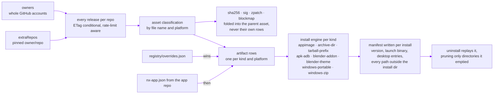
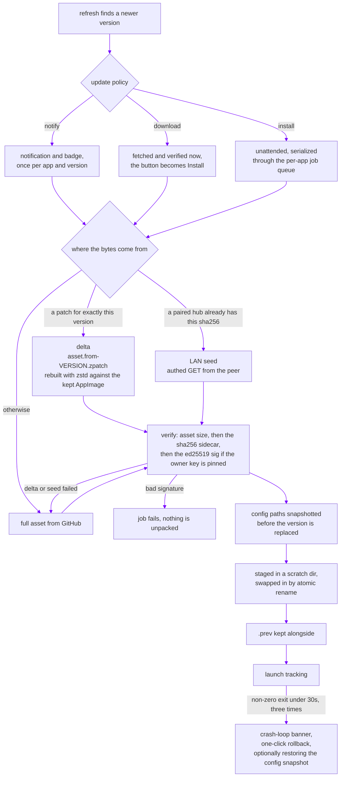
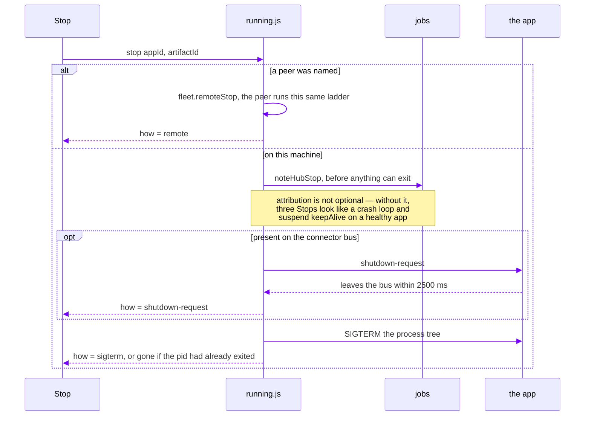
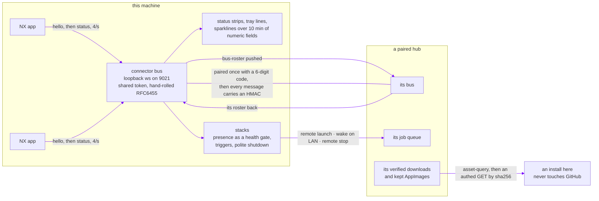
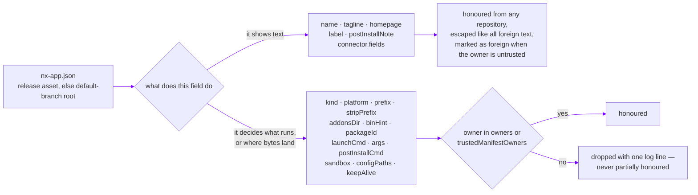

<div align="center">


# NX Hub

### One place for every app you ship.

**Installer · Updater · Launcher — powered directly by your GitHub releases.**

[](https://github.com/nerdrx/nx-hub/releases/latest)
[](LICENSE)


<br>


<br><br>


</div>

<br>

NX Hub turns a GitHub account into a first-class software distribution channel.
It discovers every repository you publish, understands the artifacts inside each
release, and operates the entire lifecycle that follows: installation, updates,
version pinning, rollback, launching, stopping, and provably clean removal —
across Linux, Windows, and Android.

There is no store to submit to, no manifest to maintain, no update server to
operate, and no packaging format to adopt. GitHub Releases *is* the backend.
The moment a release goes live, it is live in the hub — on every desktop and
every device, simultaneously.

Current version: **0.14.1**.

<br>

## Table of contents

- [Capabilities](#capabilities)
- [Discovery, classification, install](#discovery-classification-install)
- [The integrity pipeline](#the-integrity-pipeline)
- [How an update reaches a machine](#how-an-update-reaches-a-machine)
- [Stopping an app](#stopping-an-app)
- [The Connector and the fleet](#the-connector-and-the-fleet)
- [Publishing an app](#publishing-an-app)
- [Memory: recorder, snapshots, checkpoints](#memory-recorder-snapshots-checkpoints)
- [Running headless](#running-headless)
- [Device support](#device-support)
- [The Android companion](#the-android-companion)
- [The terminal](#the-terminal)
- [Getting started](#getting-started)
- [Configuration](#configuration)
- [The registry overlay](#the-registry-overlay)
- [Architecture](#architecture)
- [Design system](#design-system)
- [Development](#development)
- [FAQ](#faq)

<br>

## Capabilities

| | |
| --- | --- |
| **Zero-registration discovery** | Entire GitHub accounts and hand-pinned repositories, public and private, enumerated automatically. New repos and releases surface on the next refresh cycle. |
| **Per-artifact install engines** | Purpose-built strategies for AppImages, prefix tarballs, APKs, Blender add-ons and themes, and Windows portables — not a generic downloader. |
| **Transactional installs** | Staged extraction with atomic rename-swaps. A failed download, checksum, or unpack can never strand a broken half-install. |
| **Manifest-exact uninstalls** | Every file written outside an install's own directory is recorded; removal replays the manifest, byte-for-byte accountable. |
| **Policy-driven updates** | Notify, pre-download, or auto-install — globally or per app — with OS notifications, per-version deduplication, and skip lists. |
| **Delta updates** | When a release publishes a `zstd --patch-from` patch, an AppImage update downloads the patch and rebuilds locally, then verifies against the full asset's checksum. |
| **Provenance** | Asset size, `.sha256` sidecar, and — for owners whose ed25519 key is pinned in the hub — a `.sig` signature, checked before anything unpacks. |
| **Version time travel** | Full release history per app, install-any-version with downgrade confirmation, one-click rollback to the retained previous install, and `nx bisect` to find the first bad release. |
| **Launch and stop** | Icon tiles ordered by favorites and recency, tray quick-launch, multi-app stacks with health gates and triggers, and a Stop control wherever the UI says something is live. |
| **The Connector bus** | Apps hold a loopback WebSocket to the hub and stream status fields; cards show live values with sparklines, and presence becomes a health gate. |
| **The fleet** | Paired hubs on a LAN relay rosters, install and launch on each other, wake each other over WOL, sync per-app prefs, and seed verified assets to each other instead of re-downloading. |
| **Self-hosting** | The hub is an entry in its own catalog and updates itself through the identical pipeline, relaunching into the new binary. |
| **A first-class CLI** | The same engine from any shell, with `--json` for scripting, plus a headless `nx daemon` that runs everything without a window. |

<br>

## Discovery, classification, install

Discovery is a fan-out over your configured sources: each account in `owners`
is enumerated through the authenticated `/user/repos` listing (which includes
private repositories) or the public listing when anonymous, unioned with every
pinned `extraRepos` entry. For each repository the hub retrieves the complete
release list — not merely `/releases/latest` — so prerelease channels, version
history, and cross-release artifact resolution all operate on full information.



Every API interaction is **ETag-conditional**: responses are cached on disk and
revalidated with `If-None-Match`, so an idle refresh cycle costs a handful of
`304 Not Modified` responses rather than repeated payloads. Rate-limit headers
are tracked continuously; when GitHub throttles, the hub surfaces the reset
time and degrades gracefully instead of failing opaquely.

Installs land under `~/Applications/nx/<appId>/<artifactId>/` — never as root,
never through a system package manager.

**Cross-release artifact resolution.** A release that ships only one platform
must not degrade the rest. Artifacts are resolved per *kind + platform*: each
comes from the newest eligible release that actually carries it, is labelled
with the version of that source release, and is diffed against that version for
update detection. An Android-only hotfix therefore advances the APK row alone,
while the desktop rows remain anchored — correctly — to their own newest
builds. Older releases participate strictly as **gap-fillers**: they may
contribute a platform the newer releases lack entirely, never a duplicate
flavor of one they already cover.

Version comparison normalizes both operands through the same parser, so tag
prefixes (`v1.2.3`, `nx-1.3`) and device-reported `versionName` strings compare
by content, never by formatting accident.

<br>

## The integrity pipeline

Every byte between GitHub and your disk is accounted for:

1. **Transport.** Assets stream through the authenticated API endpoint (so
   private-repo downloads work identically), with the hash/progress meter
   implemented as a stream-pipeline stage — a single-consumer design that makes
   out-of-order interleaving structurally impossible.
2. **Length verification.** The on-disk byte count is checked against the
   release's authoritative asset size. A cleanly closed early stream — the kind
   that ends without a socket error — is detected and retried with backoff
   rather than passed to the extractor.
3. **Checksum verification.** When a release publishes a `.sha256` sidecar, the
   download is verified against it before anything is unpacked.
4. **Signature verification.** When a `.sig` sibling exists *and* the repo owner
   has a pinned ed25519 key, the signature over the asset's digest is checked.
   A mismatch is a hard failure with no fallback; an absent signature is logged
   and allowed, unless `requireSignatures` is on.
5. **Staged installation.** Extraction happens in a scratch sibling directory;
   the live install is replaced by atomic rename only after the stage is
   complete. The previous version is retained as `.prev` for rollback.
6. **Manifest accounting.** Each install writes a manifest of its version,
   kind, launch binary, desktop entries, and every path written outside its own
   directory. Uninstall replays the manifest; prefix installs remove exactly
   the files they created and prune only directories they emptied.

Failures at any stage roll back to the pre-transaction state. There is no
"partially installed" in the hub's vocabulary.

An asset lock covers download → verify → install → cleanup per asset path, so
a GUI hub applying an update policy and an `nx update` in a terminal cannot
verify and unlink each other's bytes.

<br>

## How an update reaches a machine

After every refresh — scheduled, manual, or startup — the policy engine sweeps
all artifacts with pending updates and applies the effective policy, resolved
per app with global fallback. What happens next depends on what is already on
this LAN and on this disk:



Prerelease opt-in is per app; skipped versions suppress exactly the skipped
version and re-arm on the next; downgrades demand explicit confirmation; and
concurrent transfer count is a user-tunable semaphore, distinct from the
per-app install serialization.

Delta updates are opt-in on the publishing side (`scripts/release.sh --delta`),
apply to AppImages on Linux, and require the full asset's `.sha256` — the patch
result is only accepted when it hashes to the file the release says it is.
Any missing piece falls back to the full download silently.

<br>

## Stopping an app

Launching used to be one-way. Since v0.11 the hub's ladder for ending a stack
is reachable for a single app, from the card, from a launcher tile, and from
`nx stop`. It never sends SIGKILL:



An app that ignores the polite request is not an error — it falls through to
the signal. An app under the `keepAlive` watchdog stays stopped, because the
supervisor reads the same hub-stop mark.

<br>

## The Connector and the fleet

The hub hosts a local rendezvous bus. Apps announce themselves and stream
status fields; the hub renders them, gates stacks on them, and relays them to
paired hubs on the LAN.



Discovery between hubs is a UDP beacon on `:9022`; the session is a WebSocket on
`:9023` carrying `{seq, mac}` on every message, so a paired link is
replay-proof on a LAN. Peers exchange app summaries, relay each other's bus
rosters (a `connector` health gate on a peered stack step checks the *remote*
roster), sync `appPrefs` and stacks last-writer-wins — and never sync tokens,
sources, install roots, or anything else machine-local.

Drop-in client for JS apps: [`docs/connector/nx-connector.js`](docs/connector/nx-connector.js),
zero dependencies, auto-reconnect, silent when no hub is running. The wire
format for everyone else: [`docs/connector/PROTOCOL.md`](docs/connector/PROTOCOL.md).

<br>

## Publishing an app

Any program can be published through the hub: cut a GitHub release whose assets
are classifiable per platform, publish `.sha256` sidecars, and — optionally —
ship an `nx-app.json` so the app describes itself instead of being described in
someone else's repository.

A manifest is data from a repo, not instructions, so its fields split on one
question:



The reason is concrete rather than moral: `postInstallCmd` is the string a Run
button hands to a shell after rewriting `sudo` to `pkexec`. "Show this sentence"
and "offer to run this as root" cannot be the same privilege.

Precedence is **`registry/overrides.json` > the repo's `nx-app.json` > the
hub's derived defaults**, so a wrong note can be fixed on every hub at the next
refresh without waiting for that app to cut a release. Validate before you
publish — it is a pure validator, no network, so it belongs in CI:

```bash
nx manifest check --file nx-app.json   # exit 0 valid, 1 invalid
nx manifest init <app>                 # print the manifest for an app already curated
```

The whole contract, field by field, with a worked example:
[**docs/PUBLISHING.md**](docs/PUBLISHING.md).

<br>

## Memory: recorder, snapshots, checkpoints

The hub keeps a flight recorder — a rotating JSONL journal of installs,
updates, rollbacks, uninstalls, job outcomes, stack phases, bus joins and
leaves, and crashes:

```bash
nx log --since 24h --type job-done --app wivrn-nx --follow
```

Before an update replaces a version, and before an uninstall, the configured
`configPaths` for that app are archived to a `tar.zst` snapshot (last five kept
per app). Rollback offers to restore the matching one.

Together those two make the ecosystem addressable in time. `nx checkpoint`
reconstructs what was installed at a moment from the journal, and can walk the
difference back through the ordinary install, uninstall and restore pipelines:

```bash
nx checkpoint show "3 days ago"
nx checkpoint restore "3 days ago" --configs
```

Releases that have since been deleted are reported as skipped, not guessed at.

For installs that drifted on disk rather than in time, the deep audit checks
every install against its own manifest — directory present, manifest parses,
launch binary present and executable, every recorded outside file present, kept
AppImage still hashing to what the index says, desktop entries where they were
recorded — and can repair by reinstalling:

```bash
nx doctor --deep
nx doctor --deep --repair
```

<br>

## Running headless

The whole hub minus Electron: discovery, jobs, update policies, the connector
bus, the fleet, stacks and triggers, the recorder, and the refresh scheduler.

```bash
nx daemon run        # foreground, clean SIGTERM shutdown
nx daemon install    # writes a systemd --user unit and prints the enable command
nx daemon status
nx daemon uninstall
```

It refuses to start when the connector or fleet port is already bound — that is
a GUI hub, and two of them would fight over the same state.

<br>

## Device support

Android hardware is a first-class install target, not an afterthought.
The device panel handles wireless adb (`host:port` pairing with sane defaults),
multi-device selection with a persisted preference, and pre-flight facts —
model, battery percentage, free storage — before an APK is committed.
Installed versions are read live from the device (`dumpsys`-derived, normalized
before comparison), so the hub reflects what is actually on the hardware, not
what it last remembers installing. Installed packages launch remotely through
the activity manager.

<br>

## The Android companion

A self-contained companion app — about 690 KiB, **zero runtime dependencies**;
plain `HttpsURLConnection`, platform JSON, and stock widgets — brings the
catalog to the device itself. It performs the same source enumeration and
overlay merge, installs through Android's `PackageInstaller` session API
(including seamless self-update), tracks installed versions through
`PackageManager`, and stores its GitHub token encrypted via a hardware-backed
`AndroidKeyStore` AES-GCM key. Release fallback logic mirrors the desktop:
a desktop-only patch release never evicts an app from the phone's list.

<br>

## The terminal

`nx` is a thin presentation layer over the same modules the GUI drives — no
re-implementation, no dependencies, and no window. It works while the GUI is
running.

| Command | Does |
| --- | --- |
| `nx list [--all] [--json]` | every app: installed version, latest, status |
| `nx info <app> [--json]` | one app in detail: artifacts, sources, notes |
| `nx install <app> [artifact] [--tag <tag>]` | install (or reinstall) an artifact |
| `nx uninstall <app> [artifact]` | remove an installed artifact |
| `nx update [<app>] [--all]` | bare lists what is pending; `--all` installs it |
| `nx launch <app> [artifact]` | start an installed app |
| `nx stop <app> [artifact] [--peer <name>]` | end a running app — politely, never SIGKILL |
| `nx rollback <app> [artifact]` | restore the kept previous version |
| `nx versions <app> [--json]` | every published release |
| `nx refresh [--force] [--json]` | re-run discovery; `--force` bypasses the ETag cache |
| `nx doctor [--deep] [--repair] [--offline]` | environment: adb, token, paths, rate limit — and, deep, every install against its manifest |
| `nx status [--json]` | the Connector bus: who is live right now |
| `nx stack ls \| run <id> \| stop <id>` | multi-app stacks |
| `nx fleet ls \| pair <host> \| install <peer> <app> \| update <peer> \| wake <peer>` | the other NX Hubs on your LAN |
| `nx dev ls \| link <path> \| unlink <id> \| run <id>` | working trees you are hacking on |
| `nx bisect <app> [artifact] \| good \| bad \| skip \| status \| reset` | binary-search releases for the first bad one |
| `nx snapshots <app>` · `nx restore <app> [file]` | config snapshots taken before updates, and putting one back |
| `nx log [--since 24h] [--type x] [--app y] [--follow]` | the flight recorder |
| `nx daemon run \| install \| uninstall \| status` | the hub as a background service |
| `nx checkpoint show <when> \| restore <when> [--configs]` | what was installed then — and putting it back |
| `nx manifest check [--file <path>] \| init <app>` | `nx-app.json`: validate one, or print ours |

Apps match on id, name, or unambiguous prefix — `nx info wiv` works. Output is
24-bit ANSI on a TTY and plain text otherwise (`--plain`, `NO_COLOR`);
progress goes to stderr so stdout stays clean for pipes; `--json` is the only
thing on stdout in JSON mode, errors included. Exit codes: `0` ok, `1` usage
error, `2` operation failed.

The hub writes `~/.local/bin/nx` on startup (a marker-guarded shim that runs
the bundled Electron as plain node); `nx shim --force` rewrites it.

<br>

## Getting started

**Linux** — download from [Releases](https://github.com/nerdrx/nx-hub/releases/latest), then:

```bash
chmod +x NX-Hub-*-linux.AppImage
./NX-Hub-*-linux.AppImage
```

**Windows** — run the portable `.exe` from the same page.

**Android** — install the APK on the device, or let the desktop hub sideload it
over adb once a device is connected.

Every published file carries a `.sha256` sibling for independent verification,
and a `.sig` for anyone holding the pinned key:

```bash
sha256sum -c NX-Hub-*-linux.AppImage.sha256
```

<br>

## Configuration

**Settings → Sources** defines the discovery universe:

| Setting | Purpose |
| --- | --- |
| `owners` | GitHub accounts scanned in full. Default: `nerdrx`, `Arikazei`. |
| `extraRepos` | Individually pinned `owner/repo` entries from any account. |
| `trustedManifestOwners` | Extra owners whose `nx-app.json` may set executing fields. Default: empty. |

Private repositories require a token. If the [`gh` CLI](https://cli.github.com/)
is authenticated, the hub resolves its token automatically; otherwise a
fine-grained personal access token with read access to your repositories can be
entered in Settings. Anonymous operation works on public repositories, at
GitHub's substantially lower unauthenticated rate budget — the token is worth
adding for headroom alone.

Further knobs: theme (light / dark / system), global and per-app update policy,
prerelease channels, refresh interval, install root, adb path, download
concurrency, `requireSignatures`, `fleet` and `fleetSync` and `lanSeeding`
toggles, the `keepAlive` watchdog and bwrap sandbox profile per app, autostart
with start-minimized, desktop-entry creation, per-app launch arguments and
environment overrides, and settings export/import — with credentials
categorically excluded from every export.

<br>

## The registry overlay

Discovery is fully automatic; the overlay refines presentation and installation
semantics. [`registry/overrides.json`](registry/overrides.json) supplies
display names, taglines, ordering, install-strategy hints for artifacts that
need them (prefix paths, package ids, launch commands, post-install notes),
connector field definitions, and an owner-scoped `hidden` list:

```jsonc
{
  "hidden": ["nerdrx/some-scratch-repo"],
  "apps": {
    "wivrn-nx": {
      "name": "WiVRn NX",
      "tagline": "Wireless VR streaming, tuned",
      "order": 10,
      "artifacts": [
        { "assetPattern": "*.apk", "label": "Headset APK",
          "kind": "apk-adb", "packageId": "org.meumeu.wivrn" }
      ]
    }
  }
}
```

The overlay is fetched live from this repository's `main` branch, so curation
propagates to every installed hub — desktop and Android — without shipping a
release; the bundled snapshot serves as offline fallback. Hidden entries are
owner-scoped by design: `owner/repo` hides exactly that repository, while a
bare name applies only to the primary account, so an identically-named
repository from another source can never inherit the hiding. Repositories the
overlay does not mention appear under their own names — curation is optional
everywhere.

> The overlay is a public file. It may reference private repository names —
> that is intentional and harmless. **Secrets never belong in the overlay.**

<br>

## Architecture

Three layers, one frozen contract:

- **Main process** — discovery and classification, the ETag-cached rate-aware
  GitHub client, the job queue with per-app serialization and a global transfer
  semaphore, the update-policy engine, the connector bus, the fleet, stacks and
  triggers, the supervisor, the recorder, snapshots and checkpoints, the audit,
  window/tray lifecycle, and device orchestration. Pure-Node modules throughout;
  Electron APIs touch only the boundary files, which keeps the entire logic
  layer unit-testable without a display server — and lets `nx` and `nx daemon`
  drive the same modules with no Electron API at all.
- **Install engines** — one module per artifact kind behind a fixed dispatcher
  interface (`install`/`uninstall`/`launch`/rollback), each emitting phase-level
  progress and writing the manifest that makes its uninstall provable.
- **Renderer** — dependency-free, framework-free, bundler-free: pure string
  renderers hydrated through a single delegated event layer, defensive
  normalizers over the IPC payload, and capability probing so the UI degrades
  feature-by-feature rather than breaking against an older main process.

[**SPEC.md**](SPEC.md) is the authoritative contract for all three: the app
model, the IPC surface, install-kind semantics, and the visual language.
Verification runs at three levels: hermetic unit suites (mock GitHub server,
temp filesystems, fake adb), an end-to-end harness that drives the real
application against a fixture API inside a headless compositor, and
screenshot-reviewed visual passes.

<br>

## Design system

The interface is built on **NX Clear** — light-first, rounded and flat, chosen
because the hub is the thing people meet first and it should read clean and
professional rather than atmospheric. Depth is one soft shadow plus a single
1px hairline; nothing is translucent except the modal scrim. The dark variant
is grounded at true black for OLED panels, where a shadow cannot fall on the
page and the hairline carries the separation instead. Theme follows the OS by
default and can be pinned light or dark in Settings. Violet `#7700FF` is the
one accent, spent on the primary action, the active state, focus and the mark —
never as a field. Cards flow in a masonry layout that packs by height, the
content column scales to ultrawide displays, and every decorative motion
collapses under `prefers-reduced-motion` to opacity-only transitions. The mark
is a faceted crystal hexagon with a sculpted monogram, shipped as three
size-specific variants so it stays crisp from a 16-pixel tray to a 512-pixel
tile.

The full language — including the deep-space dark sheet the immersive NX apps
still wear — is documented in [docs/DESIGN.md](docs/DESIGN.md).

<br>

## Development

```bash
npm install

npm start          # run the hub
npm test           # full unit suite (node --test, hermetic, no network)
npm run e2e        # end-to-end against a mock GitHub API
npm run nx -- list # the CLI from the checkout
npm run dist:linux # AppImage     -> dist/
npm run dist:win   # portable exe -> dist/  (uses wine)
```

GUI verification runs inside a headless gamescope compositor — never on your
desktop:

```bash
scripts/headless_test.sh -o /tmp/hub.png
```

Releasing is one command after a version bump:

```bash
scripts/release.sh              # build, checksum, sign, publish to GitHub
scripts/release.sh --delta      # also emit zstd patches against the previous release
scripts/release.sh --dry-run    # build and checksum only
```

<br>

## FAQ

**Does this replace a package manager?**
For software you publish yourself — yes, that is the point. It does not manage
system packages and never asks for elevation; everything lives under
user-owned prefixes.

**What happens without a network connection?**
Cached discovery state renders, installed apps launch, and the next successful
refresh reconciles. The hub never blocks launching on connectivity.

**Can it install from someone else's account?**
Any account or repository can be added as a source. Bring friends.

**Why extract AppImages instead of running them directly?**
Modern distributions increasingly ship without `libfuse2`. Extraction at
install time produces a launchable tree that behaves identically everywhere —
and the original AppImage is kept alongside for portability, which is also what
delta updates patch against and what the fleet seeds to peers.

**Is the fleet safe on an untrusted network?**
Pairing is a 6-digit code shown on the target hub, and every later message
carries an HMAC over its sequence number — so injection and replay are covered.
Payloads themselves are plaintext: the threat model is a LAN, not the internet.
`fleet`, `fleetSync` and `lanSeeding` are separate switches.

**How private is my token?**
It is used exclusively as an `Authorization` header against `api.github.com`,
never logged, never exported, never synced between hubs, and on Android it is
stored encrypted under a hardware-backed keystore key.

## License

MIT — see [LICENSE](LICENSE).

---

<div align="center">
<sub>made with Claude</sub>
</div>
